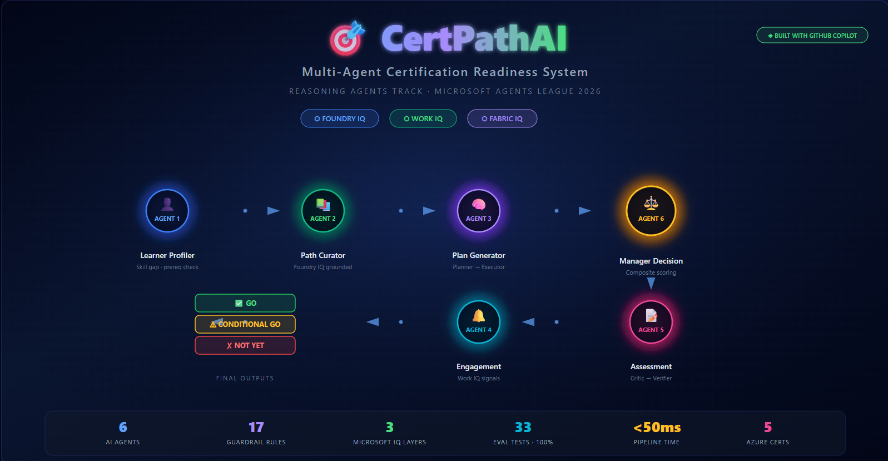
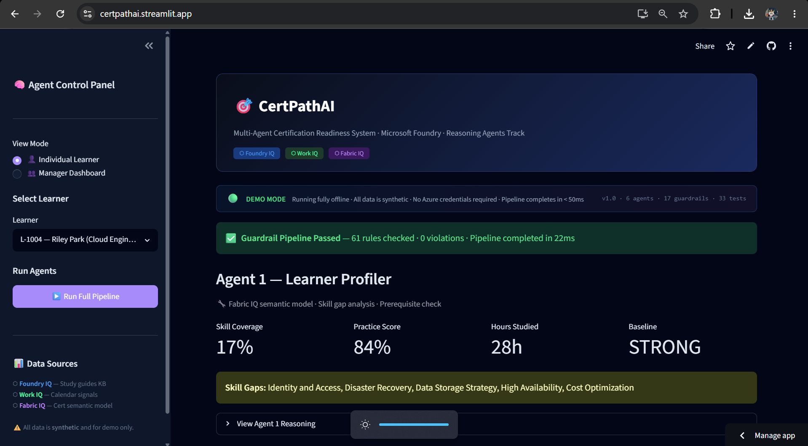
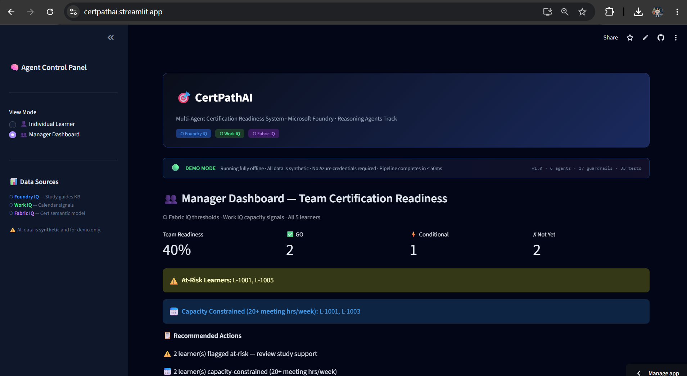
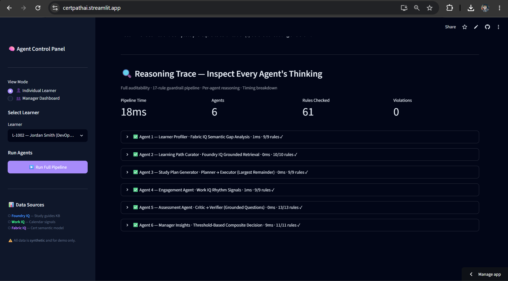
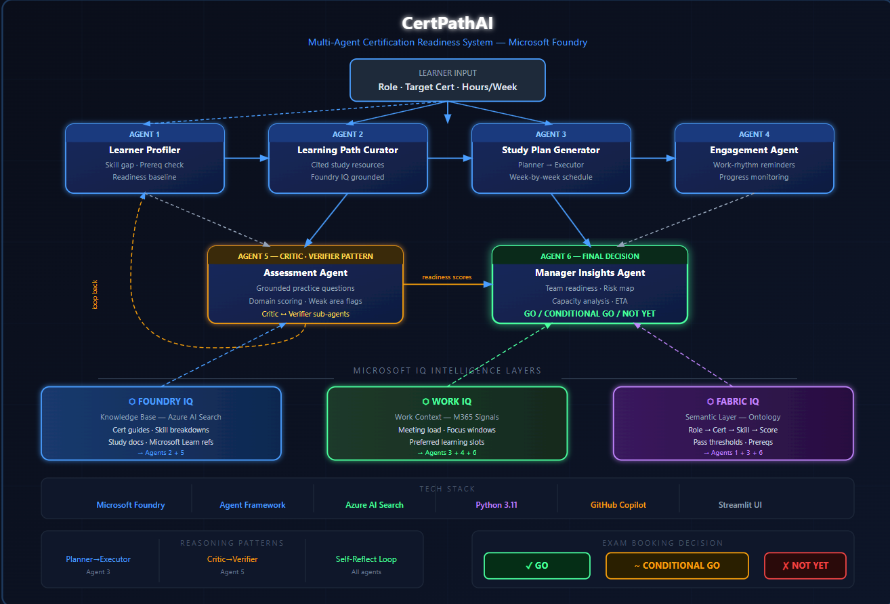

# 🎯 CertPathAI — Multi-Agent Certification Readiness System

> **Microsoft Agents League Hackathon 2026 · Reasoning Agents Track**
> Built with Microsoft Foundry · Foundry IQ · Work IQ · Fabric IQ



[](https://certpathai.streamlit.app/)
[]()
[]()
[]()

> 🚀 **[Try the live demo →](https://certpathai.streamlit.app/)** — no setup required

---

## 📸 Dashboard Screenshots

### Individual Learner View — Full Reasoning Pipeline


### Manager Dashboard — Team Readiness Overview


### Reasoning Trace + Guardrail Audit Log


### Architecture Diagram


---

## 📋 Overview

CertPathAI is a production-oriented **6-agent reasoning system** built on Microsoft Foundry that manages end-to-end Azure certification readiness for engineering teams. It targets Azure certification paths including AZ-204, AZ-400, AZ-305, DP-203, and DP-600.

The system demonstrates genuine multi-step reasoning across grounded organisational knowledge, work context signals, and semantic business understanding — delivering a final **GO / CONDITIONAL GO / NOT YET** exam booking recommendation per learner, with human confirmation required before any action is taken.

> ⚠️ **All data in this project is entirely synthetic and created for demonstration purposes only. No real employee data, customer data, PII, or proprietary information is included anywhere.**

---

## 🧠 Microsoft IQ Integration

| IQ Layer | Role in System | Agents Using It |
|---|---|---|
| **Foundry IQ** | Knowledge base for certification guides, skill breakdowns, and study documents. All answers grounded and cited. | Agent 2 (Curator), Agent 5 (Assessment) |
| **Work IQ** | Work context signals — meeting load, focus hours, preferred learning slots. Informs scheduling and reminder timing. | Agent 3 (Planner), Agent 4 (Engagement), Agent 6 (Manager) |
| **Fabric IQ** | Semantic model — Role → Cert → Skill → Score → Threshold relationships. Drives domain allocation and readiness decisions. | Agent 1 (Profiler), Agent 3 (Planner), Agent 6 (Manager) |

---

## 🏗️ Architecture

```
┌─────────────────────────────────────────────────────────────┐
│                     LEARNER INPUT                           │
│             Role · Target Cert · Hours/Week                 │
└───────────────────────┬─────────────────────────────────────┘
                        │
          ┌─────────────▼─────────────┐
          │    Agent 1: Profiler      │ ← Fabric IQ semantic model
          │ Skill gap · Prereq check  │
          └─────────────┬─────────────┘
                        │
          ┌─────────────▼─────────────┐
          │  Agent 2: Path Curator    │ ← Foundry IQ knowledge base
          │ Cited resources · Grounded│   (no hallucination)
          └─────────────┬─────────────┘
                        │
          ┌─────────────▼─────────────┐
          │ Agent 3: Study Planner    │ ← Work IQ signals
          │ PLANNER → EXECUTOR        │   Largest Remainder Algorithm
          │ Week-by-week schedule     │
          └─────────────┬─────────────┘
                        │
          ┌─────────────▼─────────────┐
          │  Agent 4: Engagement      │ ← Work IQ rhythm
          │ Progress · Reminders      │   At-risk flagging
          └─────────────┬─────────────┘
                        │
          ┌─────────────▼─────────────┐
          │  Agent 5: Assessment      │ ← Foundry IQ question bank
          │  CRITIC → VERIFIER        │   Domain scoring · Weak flags
          └─────────────┬─────────────┘
                        │
          ┌─────────────▼─────────────┐
          │ Agent 6: Manager Insights │ ← Fabric IQ thresholds
          │ Team risk · Readiness map │   Work IQ capacity signals
          │  GO / CONDITIONAL / NOT   │
          └─────────────────────────┘
```

---

## 🔄 Reasoning Patterns

| Pattern | Agent | Implementation |
|---|---|---|
| **Planner → Executor** | Agent 3 | Planner decomposes cert into domain milestones using Largest Remainder Algorithm. Executor schedules against Work IQ calendar signals. |
| **Critic → Verifier** | Agent 5 | Critic reviews question quality and difficulty balance. Verifier checks all answers against Foundry IQ source content before scoring. |
| **Self-reflection loop** | Agents 4, 6 | Agents re-evaluate decisions when confidence is low. Engagement agent loops at-risk learners back into study preparation. |
| **Role-based specialisation** | All | Each agent has a single clear responsibility. No overlap between profiling, planning, assessment, and insights. |

---

## 📁 Project Structure

```
certpathai/
├── app.py                    # Streamlit demo UI
├── requirements.txt
├── .env.example              # Environment template (no real keys)
├── .gitignore
│
├── agents/
│   ├── __init__.py
│   ├── agent1_profiler.py    # Skill gap · Prereq · Baseline (Fabric IQ)
│   ├── agent2_curator.py     # Cited resources · Foundry IQ retrieval
│   ├── agent3_planner.py     # Planner→Executor · Work IQ scheduling
│   ├── agent4_engagement.py  # Progress · Work IQ reminders · Escalation
│   ├── agent5_assessment.py  # Critic→Verifier · Grounded Q&A · Scoring
│   └── agent6_manager.py     # GO/CONDITIONAL/NOT YET · Team dashboard
│
└── data/
    ├── learners.json          # Synthetic learner profiles
    ├── work_signals.json      # Synthetic Work IQ calendar signals
    ├── certifications.json    # Fabric IQ semantic model seed
    └── study_guides.md        # Foundry IQ knowledge base documents
```

---

## 🚀 Quick Start

### Prerequisites
- Python 3.10+
- Git

### Installation

```bash
# Clone the repository
git clone https://github.com/YOUR_USERNAME/certpathai
cd certpathai

# Create virtual environment
python -m venv .venv

# Activate (Windows)
.venv\Scripts\activate

# Activate (macOS/Linux)
source .venv/bin/activate

# Install dependencies
pip install -r requirements.txt
```

### Run the Demo

```bash
streamlit run app.py
```

Open your browser at `http://localhost:8501`

---

## 🎮 Demo Guide

### Individual Learner Mode
1. Select a learner from the sidebar (e.g. *L-1001 Alex Chen — Cloud Engineer*)
2. Click **▶️ Run Full Pipeline**
3. Watch all 6 agents execute in sequence
4. Review the final **GO / CONDITIONAL GO / NOT YET** decision

### Manager Dashboard Mode
1. Switch to **👥 Manager Dashboard** in the sidebar
2. View team-wide readiness across all 5 learners
3. See at-risk flags, capacity warnings, and cert track breakdowns

---

## 📊 Synthetic Data

All data is fabricated for demonstration. The datasets include:

| File | Contents |
|---|---|
| `learners.json` | 5 synthetic learners (L-1001 to L-1005) across Cloud, DevOps, and Data Engineering roles |
| `work_signals.json` | Synthetic calendar signals — meeting hours, focus windows, preferred learning slots |
| `certifications.json` | Fabric IQ semantic model — cert-to-skill mappings, domain weights, pass thresholds |
| `study_guides.md` | Foundry IQ knowledge base — cert study guides, domain breakdowns, team learning tips |

No real names, emails, company data, or PII appears anywhere in the dataset.

---

## 🔒 Responsible AI

- **No autonomous decisions**: All GO/CONDITIONAL/NOT YET decisions require human confirmation before exam booking
- **Grounded responses only**: Agent 2 and Agent 5 refuse to recommend uncited content
- **Critic → Verifier validation**: All assessment answers verified against source before scoring
- **Privacy-conscious**: Manager dashboard surfaces team-level insights without exposing individual sensitive data
- **Synthetic data only**: No real customer, employee, or company data used anywhere

---

## 🧪 Running Individual Agents

```bash
# Run each agent independently
python -m agents.agent1_profiler
python -m agents.agent2_curator
python -m agents.agent3_planner
python -m agents.agent4_engagement
python -m agents.agent5_assessment
python -m agents.agent6_manager
```

---

## 🏆 Hackathon Track

- **Track**: Reasoning Agents (Microsoft Foundry)
- **Challenge**: Enterprise Learning & Certification Management System
- **IQ Layers Used**: Foundry IQ + Work IQ + Fabric IQ (all three)
- **Reasoning Patterns**: Planner→Executor, Critic→Verifier, Self-reflection, Role-based specialisation

---

## 📎 References

- [Microsoft Foundry Documentation](https://learn.microsoft.com/azure/ai-foundry/)
- [What is Foundry IQ?](https://learn.microsoft.com/azure/ai-foundry/foundry-iq)
- [Work IQ Overview](https://learn.microsoft.com/microsoft-365-copilot/work-iq)
- [Fabric IQ: Semantic Foundation](https://learn.microsoft.com/fabric/fabric-iq)
- [Microsoft Agent Framework](https://github.com/microsoft/agent-framework)
- [Agents League Hackathon](https://aka.ms/AgentsLeagueRules)

---

*Built for the Microsoft Agents League Hackathon 2026. All data is synthetic and for demonstration purposes only.*
